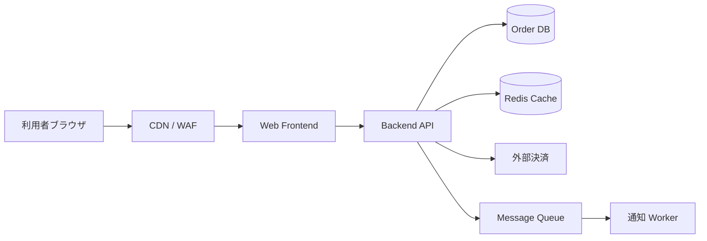
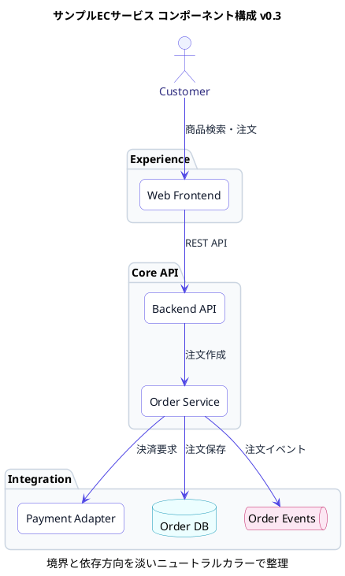

# サンプル EC サービス設計書

## 1. 概要

サンプル EC サービスは、商品検索、カート、注文、決済を提供する Web アプリケーションです。本文は Markdown で管理し、図は用途に応じて PlantUML、Mermaid、画像ファイルを利用します。

## 2. スコープ

- 利用者向けの商品閲覧と注文
- 管理者向けの商品・在庫管理
- 外部決済サービスとの連携
- 注文完了通知の送信

## 3. システム構成図（Mermaid）

Mermaid は軽量な構成図やフロー図に向いています。GitHub 上の Markdown プレビューでも一定の確認ができます。

## 4. コンポーネント図（PlantUML）

PlantUML は UML として厳密に管理したい図に向いています。以下は Markdown 内に直接 PlantUML を書く例です。

## 5. シーケンス図（PlantUML ファイル管理）

複数ドキュメントから再利用する図は `.puml` ファイルとして管理します。

PlantUML ソース: [`docs/diagrams/order-sequence.puml`](../diagrams/order-sequence.puml)

## 6. 画像アセットの管理

画面キャプチャ、手書きの概念図、既存システムの構成図などは `docs/assets/images/` に保存して参照します。

## 7. 非機能要件サンプル

| 分類 | 要件 | 補足 |
| --- | --- | --- |
| 可用性 | 月間稼働率 99.9% | CDN と Backend API を冗長化する |
| 性能 | 商品検索 P95 500ms 未満 | キャッシュを活用する |
| セキュリティ | 管理画面は SSO 必須 | 監査ログを保存する |
| 運用 | 障害通知は 5 分以内 | 監視アラートを ChatOps に連携する |

## 8. 図のバージョン管理サンプル

| 対象 | 現行版 | 管理方法 | 確認ポイント |
| --- | --- | --- | --- |
| コンポーネント図 | v0.3 | Markdown 内の PlantUML ブロックを Git 管理 | パッケージ境界、依存方向、凡例の見やすさ |
| 注文作成シーケンス | v0.3 | `docs/diagrams/order-sequence.puml` を Git 管理 | 同期処理、外部連携、永続化タイミング |

設計書サイトのヘッダーとフッターには `package.json` のドキュメントバージョン、Git ref、短縮 SHA、ビルド時刻を表示します。PR では `site/version.json` も artifact に含まれるため、レビューした HTML がどのコミットから生成されたかを確認できます。

## 9. ADR サンプル

### ADR-001: 図の管理方式

- ステータス: 採用
- 決定: UML は PlantUML、軽量な構成図は Mermaid、外部作成図は画像として管理する
- 理由: テキスト差分でレビューできる範囲を広げつつ、画像しか表現できない資料も共存させるため
