# ドキュメント生成の仕組み

## 全体像

このリポジトリでは、設計書の原稿を `docs/` 配下の Markdown、PlantUML、Mermaid、画像として管理し、**MkDocs Material** で静的 HTML サイトへ変換します。生成された `site/` ディレクトリは GitHub Actions によって artifact として保存され、main ブランチでは GitHub Pages の production サイトへ、Pull Request では PR preview として自動公開されます。

```mermaid
flowchart LR
  author[設計書を編集] --> source[docs/ / mkdocs.yml]
  source --> action[GitHub Actions]
  action --> install[依存関係をインストール]
  install --> build[npm test]
  build --> mkdocs[MkDocs strict build]
  mkdocs --> version[site/version.json 生成]
  version --> artifact[HTML artifact]
  artifact --> pages[GitHub Pages]
  pages --> reviewer[Preview URL でレビュー]
```



## ローカル生成の流れ

ローカルでは `npm test` を実行すると、JavaScript の構文チェック、MkDocs の strict build、バージョンメタデータ生成をまとめて実行します。

```bash
npm test
```

`npm test` の中身は `package.json` に定義されています。

1. `node --check scripts/write-version.mjs` でバージョン生成スクリプトの構文を確認する。
2. `python -m mkdocs build --strict` で `docs/` を `site/` に変換し、リンクや設定の問題を strict build で検出する。
3. `node scripts/write-version.mjs` で `site/version.json` を出力する。

生成結果をブラウザで確認したい場合は、ビルド後に次のコマンドで `site/` を配信します。

```bash
python3 -m http.server 8000 -d site
```

## MkDocs が担当すること

`mkdocs.yml` はサイト生成の中心設定です。ここでサイト名、テーマ、Markdown 拡張、追加 CSS / JavaScript、ナビゲーション、PlantUML hook をまとめて管理します。

| 設定 | 役割 |
| --- | --- |
| `theme` | MkDocs Material の見た目、配色、検索、コードコピーなどを設定する |
| `plugins` | 日本語検索など、サイト生成時に使うプラグインを設定する |
| `markdown_extensions` | Admonition、Details、Tabs、Task list、Mermaid などの Markdown 表現を有効化する |
| `hooks` | PlantUML のコードブロックや `.puml.svg` 参照を SVG 表示に変換する |
| `extra_css` / `extra_javascript` | サイト固有の見た目やバージョン表示を追加する |
| `nav` | サイドナビに表示するページ構成を定義する |

!!! tip "新しいページを追加したとき"
    Markdown ファイルを追加するだけでは、ナビゲーションに出ない場合があります。ページを追加したら `mkdocs.yml` の `nav` と `docs/index.md` のドキュメント一覧を更新してください。

## GitHub Actions で自動生成する流れ

GitHub Actions の workflow は `.github/workflows/pages.yml` にあります。push、Pull Request、手動実行で起動し、環境変数として Node.js、Python、公開先ブランチ、preview 配置先を定義しています。

### 1. build job

`build` job は、PR が closed された場合を除いて実行されます。

1. リポジトリを checkout する。
2. Node.js と Python をセットアップする。
3. `pip install -r requirements.txt` で MkDocs Material をインストールする。
4. `BUILD_TIME` を UTC で記録する。
5. `npm test` で静的サイトを生成する。
6. 生成された `site/` を `design-docs-site` artifact としてアップロードする。

### 2. production deploy

main ブランチへの push や手動実行など、Pull Request ではないイベントでは `deploy-production` job が実行されます。

- `design-docs-site` artifact をダウンロードする。
- `gh-pages` ブランチのルートへ `site/` を公開する。
- `previews/` は削除対象から除外し、公開中の PR preview を維持する。

### 3. PR preview deploy

同一リポジトリ内の Pull Request では `deploy-preview` job が実行されます。

- `design-docs-site` artifact をダウンロードする。
- `gh-pages/previews/pr-<PR番号>/` に PR 版の HTML を公開する。
- `previews/versions.json` に PR preview の URL、ドキュメント版、Git ref、SHA、ビルド時刻を登録する。
- PR コメントに Preview URL と Version index を投稿または更新する。

!!! warning "fork からの PR"
    GitHub Pages へ書き込む権限が必要なため、fork からの PR では preview deploy を実行しません。その場合も `design-docs-site` artifact をダウンロードして表示確認できます。

### 4. PR preview cleanup

Pull Request が closed された場合は `cleanup-preview` job が実行されます。

- `gh-pages/previews/pr-<PR番号>/` を空ディレクトリで上書きする。
- `previews/versions.json` から該当 PR の preview 情報を削除する。

## バージョン情報の見え方

`scripts/write-version.mjs` は、`package.json` のドキュメント版、Git ref、コミット SHA、短縮 SHA、ビルド時刻を `site/version.json` に出力します。追加 JavaScript の `docs/javascripts/version-sidebar.js` は、この情報を読み取り、ヘッダーのバージョンチップとサイドバーの「公開済みバージョン」に表示します。

| 表示箇所 | 何を確認するか |
| --- | --- |
| ヘッダーのバージョンチップ | 表示中サイトのドキュメント版と短縮 SHA |
| サイドバーの公開済みバージョン | Production と公開中 PR preview の一覧 |
| `site/version.json` | レビューしている HTML の生成元コミット、ref、ビルド時刻 |
| PR コメント | Preview URL と Version index |

## 変更時の注意点

- Markdown のページ構成を変えたら、`mkdocs.yml` の `nav` とリンクを更新します。
- `markdown_extensions` を追加したら、対応するサンプルを `docs/guides/mkdocs-material-cheatsheet.md` に追加します。
- GitHub Actions の公開先や preview の置き場所を変えたら、`docs/pr-visual-review.md` とこのページを更新します。
- `site/` は生成物なので、通常はコミットしません。
- PR では、`npm test` の結果、Preview URL、`site/version.json` の shortSha を確認します。
