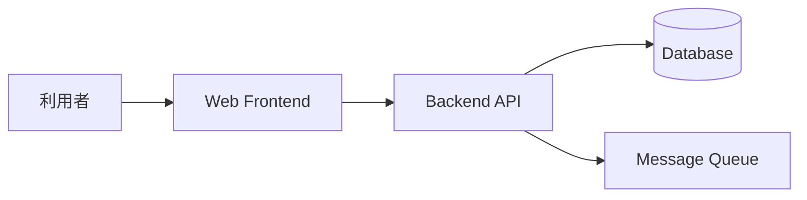
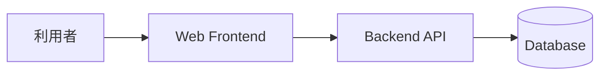
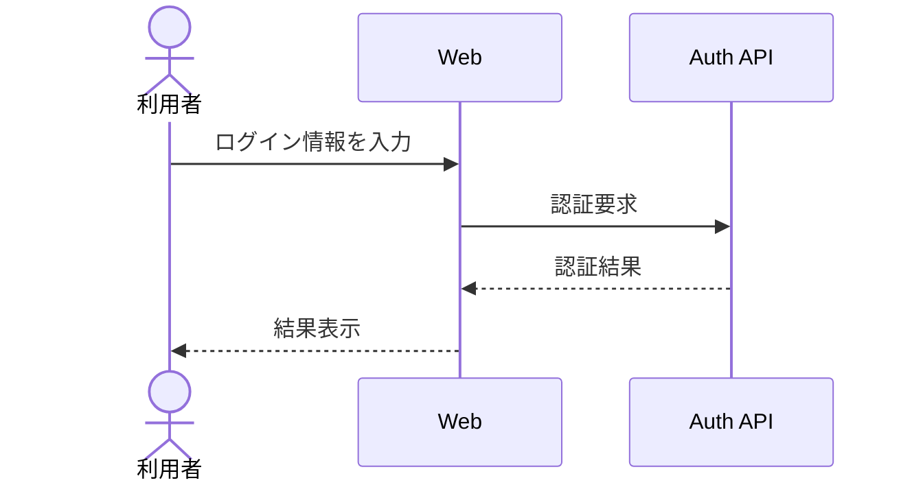

# MkDocs Material 便利機能サンプル

## 目的

MkDocs Material と有効化済み Markdown 拡張でよく使う記法を、設計書向けのサンプルとしてまとめます。新しいページを書くときは、このページから必要なパターンをコピーして使えます。

## Admonition: 注意・補足・判断を目立たせる

!!! note "設計メモ"
    なぜこの構成にしたのか、あとから読み返したい補足を書きます。

!!! warning "レビュー時に確認"
    外部サービスの SLA、課金、個人情報の取り扱いなど、見落とすとリスクになる点を強調します。

!!! success "採用済み"
    決定済みの方式や合意済みの制約を明示します。

```markdown
!!! note "設計メモ"
    なぜこの構成にしたのか、あとから読み返したい補足を書きます。
```

## Details: 長い補足を折りたたむ

??? info "検討した代替案"
    - 案 A: 実装は簡単だが、運用負荷が高い。
    - 案 B: 初期構築は必要だが、監査ログを一元化できる。
    - 結論: 案 B を採用する。

```markdown
??? info "検討した代替案"
    - 案 A: 実装は簡単だが、運用負荷が高い。
    - 案 B: 初期構築は必要だが、監査ログを一元化できる。
```

## Content tabs: 環境差分や選択肢を並べる

=== "Production"
    - 冗長化: 有効
    - 監視: 24/7 アラート
    - データ保持: 7 年

=== "Staging"
    - 冗長化: 最小構成
    - 監視: 営業時間内
    - データ保持: 30 日

```markdown
=== "Production"
    - 冗長化: 有効
    - 監視: 24/7 アラート

=== "Staging"
    - 冗長化: 最小構成
    - 監視: 営業時間内
```

## Task list: PR 前チェックをそのまま書く

- [x] 主要なシーケンスを更新した
- [x] 非機能要件への影響を確認した
- [ ] Preview URL で表示を確認した

```markdown
- [x] 主要なシーケンスを更新した
- [ ] Preview URL で表示を確認した
```

## Mermaid: 軽量な構成図を書く



````markdown

````

## Mermaid: シーケンス図をテキスト差分で管理する



!!! tip "Mermaid ソースの書き方"
    Markdown では `mermaid` のコードフェンスに `flowchart` や `sequenceDiagram` を書きます。MkDocs Material の superfences 設定でそのまま表示するため、専用 hook や外部レンダリングサービスは不要です。

## 属性指定: 画像や表にクラスを付ける

`attr_list` を使うと、画像・リンク・表などに属性を付けられます。サイズ調整や CSS 連携が必要になったときに便利です。

```markdown
{ loading=lazy }

[Preview URL を開く](../pr-visual-review.md){ .md-button .md-button--primary }
```

[Preview URL を開く](../pr-visual-review.md){ .md-button .md-button--primary }

## コードブロック: ファイル名・行番号・コピー

```yaml title="mkdocs.yml" linenums="1"
site_name: Design Docs
theme:
  name: material
```

````markdown
```yaml title="mkdocs.yml" linenums="1"
site_name: Design Docs
theme:
  name: material
```
````

## Snippets: 共通文言を差し込む

`pymdownx.snippets` を使うと、共通の注意書きやテンプレートを別ファイルから差し込めます。運用で使う場合は、共通部品を `docs/snippets/` などに置き、参照箇所を最小限にします。

```markdown
--8<-- "docs/snippets/review-checklist.md"
```

!!! warning "Snippets 利用時の注意"
    参照先ファイルが存在しないと strict build で検出しづらいケースがあります。共通化しすぎると読み手が差分を追いづらくなるため、短い定型文に限定するのがおすすめです。

## 使い分けの目安

| 機能 | 向いている用途 | 注意点 |
| --- | --- | --- |
| Admonition | 重要な注意、決定事項、レビュー観点 | 使いすぎると重要度が分かりにくい |
| Details | 長い補足、代替案、ログ | 最初から読んでほしい内容は折りたたまない |
| Tabs | 環境差分、選択肢、Before/After | タブ内だけに重要情報を閉じ込めない |
| Task list | PR チェックリスト、移行作業 | 完了状態は PR ごとに更新する |
| Mermaid | フロー、構成図、シーケンス図 | 大きくなりすぎた図は分割する |
| 画像 | 外部ツールで作成した図、スクリーンショット | 元ファイルの所在や更新手順も本文に残す |
