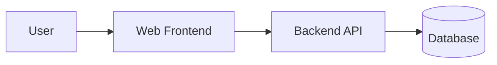
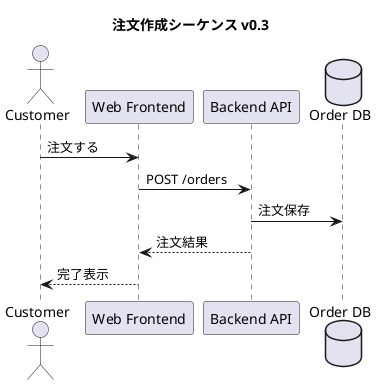

# はじめに

以前、[API仕様書はOpenAPIで書こう！](https://qiita.com/grhg/items/c5feb554764886c787b6) という記事で、API仕様書を OpenAPI としてテキスト管理し、ドキュメント生成やコード生成につなげる取り組みを紹介しました。

今回はその続編として、API仕様書だけでなく **設計書全体も Markdown で管理し、GitHub Pages 上で読みやすいドキュメントサイトとして公開する** 取り組みをまとめます。

設計書は Word / Excel / PowerPoint / Wiki など、いろいろな場所に散らばりがちです。最初は見やすくても、変更履歴が追いづらかったり、レビューしづらかったり、どの資料が最新なのか分からなくなったりします。

そこで今回は、以下を満たす設計書管理を目指しました。

- 設計書本文を Markdown で書ける
- Mermaid / PlantUML / 画像を使って図も管理できる
- Pull Request で本文や図の差分をレビューできる
- GitHub Pages に公開して、ブラウザで読みやすく確認できる
- PR ごとに Preview URL を作り、マージ前の見た目も確認できる
- 生成された HTML がどのコミットから作られたか追跡できる

# 今回作ったもの

検証用に、Markdown の設計書を **MkDocs Material** で静的サイト化するサンプルを作りました。

構成はざっくり以下です。

```text
mkdocs.yml
requirements.txt
package.json
.github/workflows/pages.yml
docs/
  index.md
  architecture/sample-ec-service.md
  diagrams/order-sequence.puml
  assets/images/sample-system-context.svg
  javascripts/version-sidebar.js
  stylesheets/design-docs.css
  versioning.md
hooks/
  plantuml.py
scripts/
  write-version.mjs
```

主な役割は以下の通りです。

| ファイル | 役割 |
| --- | --- |
| `mkdocs.yml` | MkDocs Material のテーマ、ナビゲーション、Markdown 拡張、Mermaid 設定 |
| `docs/**/*.md` | 設計書本文 |
| `docs/diagrams/*.puml` | 再利用する PlantUML 図 |
| `hooks/plantuml.py` | PlantUML のコードブロックや `.puml.svg` 参照を SVG 表示に変換 |
| `scripts/write-version.mjs` | ビルド後に `site/version.json` を出力 |
| `.github/workflows/pages.yml` | GitHub Pages への production / PR preview 公開 |

# なぜ MkDocs Material にしたか

最初は Markdown を HTML に変換するだけなら自作でもできそうに見えます。

ただ、設計書サイトとして運用する場合は、本文変換以外にも欲しい機能がたくさんあります。

- サイドナビゲーション
- ページ内目次
- 検索
- コードブロックのハイライト
- コードコピー
- ダークモード
- 日本語表示
- GitHub Pages との相性

これらを自前で作り込むより、MkDocs Material に任せた方が早く、見た目も安定します。

今回の `mkdocs.yml` では、テーマ、検索、ナビゲーション、Markdown 拡張、Mermaid 対応などをまとめて設定しています。

```yaml
site_name: Design Docs
site_description: Markdown と UML で管理する設計書ポータル
docs_dir: docs
site_dir: site

theme:
  name: material
  language: ja
  features:
    - navigation.sections
    - navigation.instant
    - navigation.top
    - toc.follow
    - search.suggest
    - search.highlight
    - content.code.copy

plugins:
  - search:
      lang: ja
```

# Markdown で設計書を書く

設計書本文は普通の Markdown として `docs/` 配下に置きます。

例えばサンプルでは、EC サービスの設計書として以下のような内容を管理しています。

- 概要
- スコープ
- システム構成
- コンポーネント構成
- シーケンス図
- 画像アセット
- 非機能要件
- ADR

Markdown にしておくと、Pull Request 上で普通のコードと同じように差分レビューできます。

```markdown
## 非機能要件サンプル

| 分類 | 要件 | 補足 |
| --- | --- | --- |
| 可用性 | 月間稼働率 99.9% | CDN と Backend API を冗長化する |
| 性能 | 商品検索 P95 500ms 未満 | キャッシュを活用する |
| セキュリティ | 管理画面は SSO 必須 | 監査ログを保存する |
| 運用 | 障害通知は 5 分以内 | 監視アラートを ChatOps に連携する |
```

設計書のレビューで大事なのは「文章の変更」と「図の変更」を同じ PR で追えることだと思っています。

# 図の管理

設計書では図が重要です。

今回のサンプルでは、用途に応じて以下を使い分けています。

| 種類 | 用途 | 管理方法 |
| --- | --- | --- |
| Mermaid | 軽量な構成図やフロー図 | Markdown 内のコードブロック |
| PlantUML コードブロック | そのページ専用の UML 図 | Markdown 内のコードブロック |
| `.puml` ファイル | 複数ページから参照したい UML 図 | `docs/diagrams/*.puml` |
| 画像ファイル | 画面キャプチャや既存資料 | `docs/assets/images/` |

## Mermaid

MkDocs Material と `pymdownx.superfences` を使うことで、Markdown 内に Mermaid をそのまま書けます。

````markdown

````

軽い構成図や状態遷移のように、Markdown 内で完結させたい図に向いています。

## PlantUML

一方で、シーケンス図やコンポーネント図のように PlantUML で書きたい図もあります。

今回は MkDocs の hook を使って、以下の 2 パターンに対応しました。

1. Markdown 内の `plantuml` コードブロック
2. `.puml` ファイルを `*.puml.svg` として参照する画像リンク

例えば、Markdown から `.puml` ファイルを参照する場合は以下のように書きます。

```markdown

```

実体は `docs/diagrams/order-sequence.puml` に置いておき、ビルド時に PlantUML の SVG URL に変換します。



この方式にすると、図のソースも Git で差分レビューできます。

# ローカルで確認する

ローカルでは以下のコマンドでビルドできます。

```bash
python3 -m venv .venv
source .venv/bin/activate
pip install -r requirements.txt
npm test
python3 -m http.server 8000 -d site
```

`http://localhost:8000` を開くと、生成された設計書サイトを確認できます。

`npm test` では以下を実行しています。

```json
{
  "scripts": {
    "build": "python -m mkdocs build --strict && node scripts/write-version.mjs",
    "test": "node --check scripts/write-version.mjs && python -m mkdocs build --strict && node scripts/write-version.mjs"
  }
}
```

`mkdocs build --strict` にしておくと、リンク切れなどを検出しやすくなるのでおすすめです。

# GitHub Pages に公開する

main ブランチにマージされた設計書は、GitHub Actions でビルドして GitHub Pages に公開します。

今回の workflow では production の公開先として `gh-pages` ブランチのルートを使っています。

```yaml
on:
  push:
    branches: [main]
  pull_request:
    types: [opened, reopened, synchronize, closed]
  workflow_dispatch:
```

push / PR / 手動実行に対応し、まずは共通の build job でサイトを生成します。

```yaml
- name: Install documentation dependencies
  run: pip install -r requirements.txt
- name: Build design docs
  run: npm test
- name: Upload built site artifact
  uses: actions/upload-artifact@v4
  with:
    name: design-docs-site
    path: site
```

main への push では、生成済みの `site/` を `gh-pages` ブランチに公開します。

# PR Preview URL を作る

設計書を Markdown で管理すると、Pull Request の差分は見やすくなります。

ただし、Markdown の差分だけでは以下を見落としがちです。

- Mermaid / PlantUML の表示崩れ
- 画像リンク切れ
- 表の横幅や改行
- ナビゲーション上の見え方
- 実際の HTML での読みやすさ

そこで、PR ごとに GitHub Pages 上へ preview を公開するようにしました。

```text
production:
  https://<owner>.github.io/<repo>/

PR preview:
  https://<owner>.github.io/<repo>/previews/pr-<PR番号>/
```

workflow では、同じ `gh-pages` ブランチの `previews/pr-<番号>/` に PR 版の HTML を配置します。

```yaml
- name: Publish PR preview to gh-pages subpath
  uses: peaceiris/actions-gh-pages@v4
  with:
    github_token: ${{ secrets.GITHUB_TOKEN }}
    publish_branch: gh-pages
    publish_dir: ./site
    destination_dir: previews/pr-${{ github.event.pull_request.number }}
    keep_files: true
```

さらに、PR コメントに Preview URL を投稿することで、レビュアーが HTML artifact をダウンロードしなくても見た目を確認できます。

# 公開済みバージョンをサイドバーから辿れるようにする

PR preview を作るだけだと、URL を知らないと辿れません。

そこで、preview の一覧を `previews/versions.json` に登録し、各ページのサイドバーから production と PR preview を辿れるようにしました。

イメージとしては以下のようなメタデータを持ちます。

```json
{
  "updatedAt": "2026-06-11T00:00:00.000Z",
  "previews": [
    {
      "kind": "pr-preview",
      "prNumber": 12,
      "title": "設計書を更新",
      "url": "https://example.github.io/md-to-design-doc/previews/pr-12/",
      "docVersion": "0.3.0",
      "shortSha": "abc1234",
      "buildTime": "2026-06-11T00:00:00Z"
    }
  ]
}
```

これにより、レビュアーはサイト上から現在公開されている PR preview を確認できます。

# 生成元のコミットを追跡する

静的サイトとして公開すると、「この HTML はどのコミットから作られたのか？」が分からなくなることがあります。

そこで、ビルド後に `site/version.json` を出力するようにしました。

```json
{
  "docVersion": "0.3.0",
  "buildTime": "2026-06-11T00:00:00Z",
  "refName": "main",
  "sha": "...",
  "shortSha": "abc1234"
}
```

画面側でもこの情報を読み込み、ヘッダーやフッターにドキュメントバージョン、Git ref、短縮 SHA、ビルド時刻を表示します。

これにより、レビュー時に「今見ている HTML がどの PR / どのコミットのものか」を確認できます。

# 運用フロー

今回想定している運用フローは以下です。

1. 設計書を Markdown / PlantUML / Mermaid / 画像として更新する
2. ローカルで `npm test` を実行する
3. Pull Request を作成する
4. GitHub Actions が `npm test` を実行する
5. PR preview が `previews/pr-<番号>/` に公開される
6. PR コメントの Preview URL から HTML を確認する
7. Markdown 差分と HTML 表示の両方をレビューする
8. main にマージする
9. production の GitHub Pages が更新される

レビュー観点は以下のように分けると良さそうです。

| 観点 | 確認場所 |
| --- | --- |
| 文章の意味や要件変更 | Pull Request の Markdown 差分 |
| 図の依存方向やライフライン | `.puml` / Mermaid の差分 |
| 表示崩れやリンク切れ | PR Preview URL |
| 生成元の確認 | `version.json` / 画面上のバージョン表示 |

# やってみて良かったこと

## 設計書もコードレビューの流れに乗せやすい

Markdown と PlantUML を Git 管理することで、設計書の変更も Pull Request に乗せやすくなりました。

特に、図を画像だけで管理していると「何が変わったのか」が分かりづらいですが、PlantUML や Mermaid であれば差分を追いやすいです。

## GitHub Pages で読みやすくなる

Markdown ファイルをそのまま読むより、MkDocs Material でサイト化した方が読みやすいです。

検索、サイドバー、ページ内目次があるだけで、設計書ポータルとしてかなり使いやすくなります。

## PR Preview がレビューに効く

Markdown の差分だけでは、最終的な見た目は分かりません。

PR Preview URL があると、レビュアーが実際の HTML をすぐ確認できるため、図の崩れや画像リンク切れに気づきやすくなります。

# 注意点

## PlantUML のレンダリング方式

今回のサンプルでは、PlantUML の公開 SVG エンドポイントを使って表示しています。

社内資料や機密情報を含む設計書では、外部サービスに図の内容を送らないようにする必要があります。

その場合は、以下のような構成を検討した方がよいです。

- 自前の PlantUML Server を立てる
- CI 内で PlantUML をレンダリングして SVG を成果物に含める
- 機密性の高い図は別管理にする

## GitHub Pages の設定

PR preview を URL で公開するには、GitHub Pages の公開元を branch-based にしておく必要があります。

設定例は以下です。

```text
Settings > Pages > Build and deployment
Source: Deploy from a branch
Branch: gh-pages
Folder: / (root)
```

production を `gh-pages` のルート、PR preview を `gh-pages/previews/pr-<番号>/` に置くことで、同じ Pages サイト内に複数バージョンを共存させています。

## fork からの PR

このサンプルでは、同一リポジトリ内の PR のみ preview を公開する想定にしています。

fork からの PR では権限やセキュリティの制約があるため、HTML artifact のみアップロードする、preview 専用リポジトリを分ける、外部ホスティングを使うなどの検討が必要です。

# まとめ

前回は OpenAPI を使って API 仕様書をテキスト管理し、ドキュメント生成やコード生成につなげる話をしました。

今回はその延長として、設計書全体を Markdown で管理し、MkDocs Material と GitHub Pages で読みやすい設計書サイトにする取り組みを紹介しました。

ポイントは以下です。

- 設計書本文は Markdown で管理する
- 図は Mermaid / PlantUML / 画像を用途別に使い分ける
- Pull Request で本文と図の差分をレビューする
- GitHub Pages で読みやすいドキュメントサイトとして公開する
- PR Preview URL でマージ前の見た目も確認する
- `version.json` で生成元のバージョンとコミットを追跡する

OpenAPI の仕様書と同じように、設計書もテキスト管理できるようにしておくと、レビュー・履歴管理・自動生成との相性が良くなります。

設計書が散らばって管理しづらくなっている場合は、Markdown + MkDocs Material + GitHub Pages の構成を試してみる価値があると思います。
